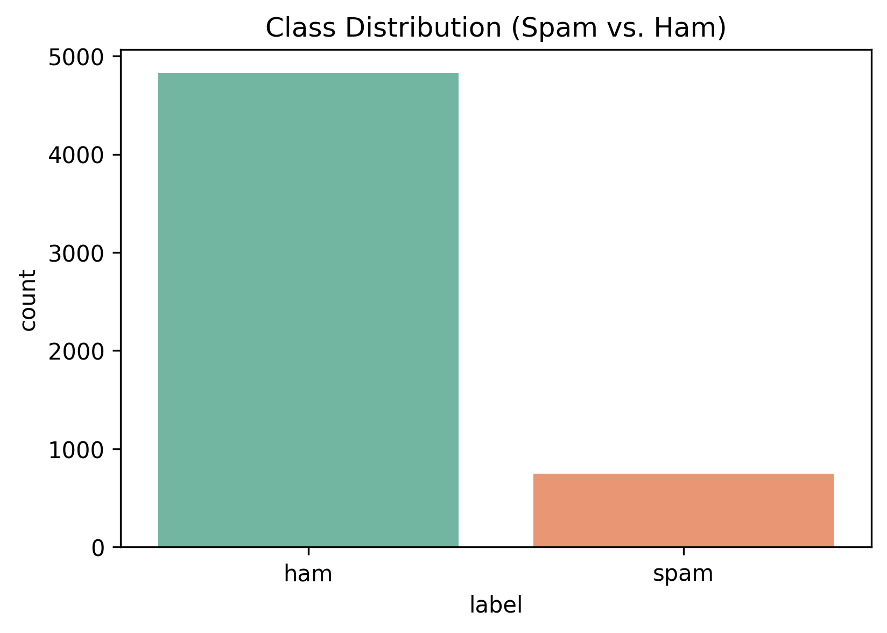
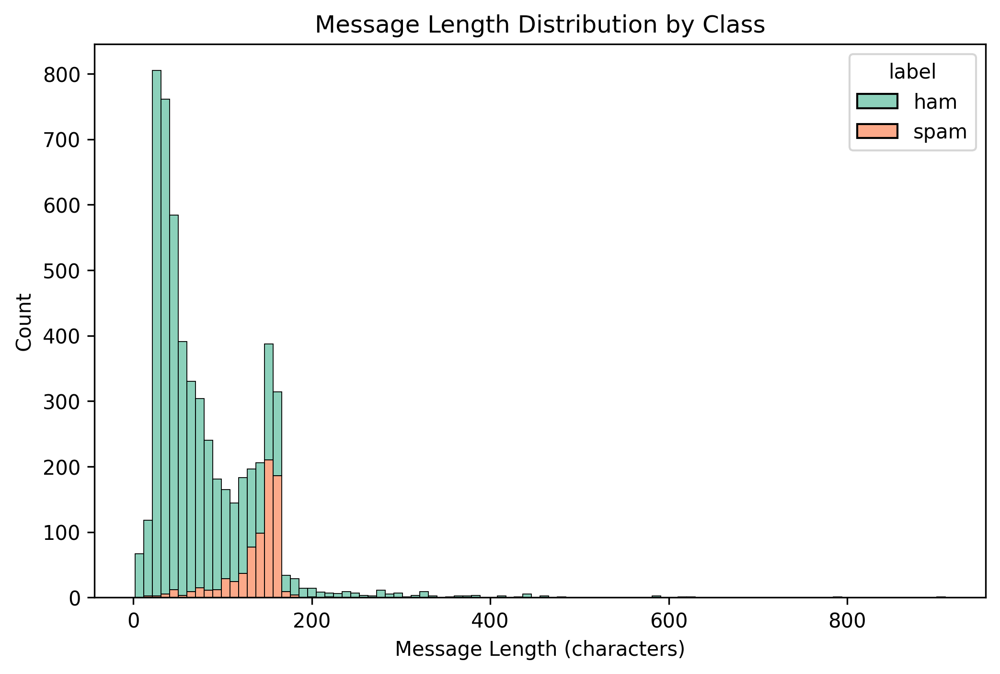
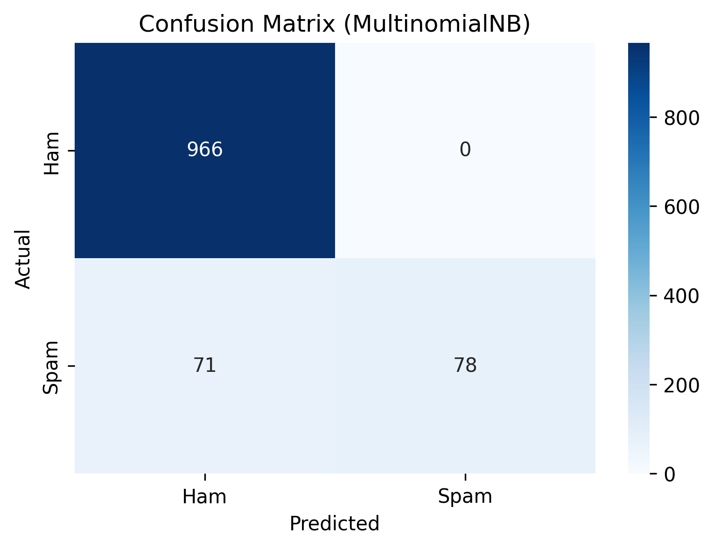
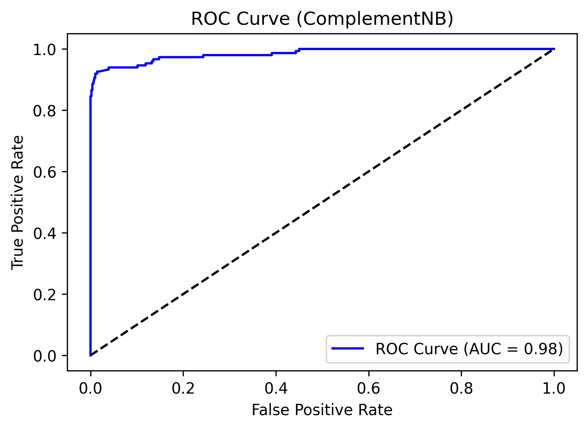
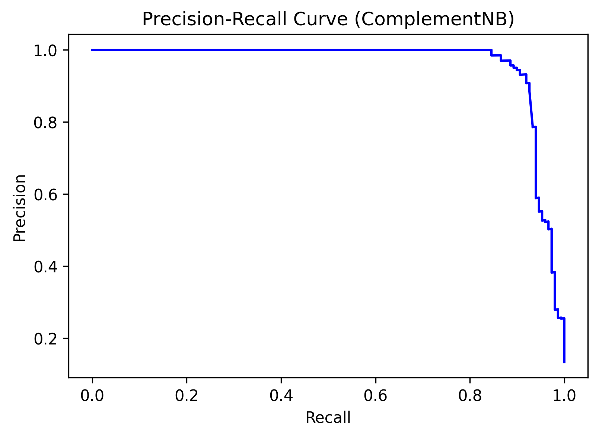
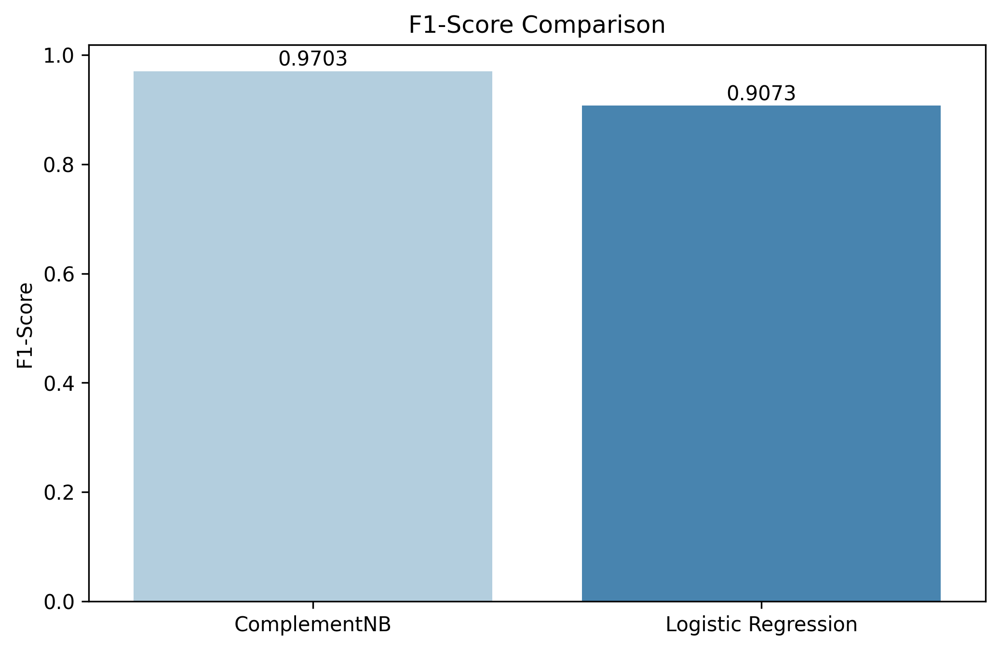

# Naive Bayes NLP Project

## Overview
This project develops a spam detection model for SMS messages using Naive Bayes with Scikit-Learn, applied to the SMS Spam Collection dataset. The goal is to showcase advanced NLP and machine learning skills, emphasizing text classification, feature engineering, and model evaluation. The best model, a tuned Complement Naive Bayes pipeline, **achieves an F1-score of 0.9703 and recall of 98.66%**, outperforming alternatives like Logistic Regression. The project includes data preprocessing, hyperparameter tuning, handling class imbalance, and professional visualizations (static with Matplotlib/Seaborn, interactive with Plotly).

Key features:
- **NLP Preprocessing**: Text cleaning, TF-IDF vectorization with trigrams, and custom features (e.g., message length).
- **Modeling**: Optimized ComplementNB pipeline with GridSearchCV, compared to MultinomialNB and Logistic Regression.
- **Experiments**: Explored SMOTE, feature selection, threshold tuning, and custom features (e.g., keywords, phone numbers).
- **Evaluation**: ROC/PR curves, confusion matrices, and F1-score comparisons.
- **Portfolio-Ready**: Clean code in Jupyter Notebook, saved model (`joblib`), and embedded visualizations.

## Dataset
- **Source**: [SMS Spam Collection](https://archive.ics.uci.edu/ml/datasets/SMS+Spam+Collection) (UCI Machine Learning Repository)
- **Details**: 5,572 SMS messages, ~13% spam (~747 messages), ~87% ham (~4,825 messages).
- **Format**: Tab-separated text file (`SMSSpamCollection`) with two columns: label (`spam` or `ham`) and message text.
- **Access**: Programmatic download or manual placement in `data/` folder (excluded from Git via `.gitignore`).

## Methodology
1. **Data Preprocessing**:
   - Cleaned text: Lowercase, removed punctuation, and eliminated English stopwords using NLTK.
   - Applied TF-IDF vectorization (10,000 features, unigrams to trigrams, `min_df=1`).
   - Added message length as a feature.
2. **Feature Engineering**:
   - Tested custom features: special character count, keyword presence (e.g., “win”, “free”), digit count, phone number detection (limited impact).
   - Explored n-grams (1-3) and feature selection (`SelectKBest`), but full TF-IDF performed best.
3. **Modeling**:
   - Implemented MultinomialNB and ComplementNB, with ComplementNB excelling for imbalanced data.
   - Tuned pipeline with GridSearchCV (`alpha=0.01`, `max_features=10000`, `ngram_range=(1, 3)`, `min_df=1`).
   - Achieved F1: 0.9703, Recall: 98.66% on test set.
4. **Class Imbalance**:
   - Tested SMOTE and class weights; ComplementNB’s design handled imbalance effectively.
5. **Experiments**:
   - Threshold tuning for higher recall (e.g., ≥0.99) reduced precision (F1: ~0.40).
   - Feature selection (`SelectKBest`) and custom features underperformed (F1: ~0.90).
6. **Comparison**:
   - Compared with Logistic Regression (F1: 0.9073, Recall: 91.95%), highlighting ComplementNB’s superiority.
7. **Evaluation**:
   - Visualized class distribution, message length, confusion matrix, ROC/PR curves, and F1-score comparisons.
   - Interactive Plotly ROC curve in notebook for portfolio appeal.
8. **Model Persistence**:
   - Saved best pipeline with `joblib` for reuse (`models/complement_nb_pipeline.joblib`).

## Results
- **Best Model**: Complement Naive Bayes Pipeline
  - **Accuracy**: 99.19%
  - **Precision**: 95.45%
  - **Recall**: 98.66%
  - **F1-Score**: 97.03%
- **Comparison**:
  - Logistic Regression: F1: 90.73%, Recall: 91.95%
  - Other experiments (SMOTE, feature selection): F1: ~90%, Recall: ~92–93%
- **Visualizations**:
  - Class Distribution: 
  - Message Length Distribution: 
  - Confusion Matrix (MultinomialNB): 
  - ROC Curve (ComplementNB): 
  - Precision-Recall Curve (ComplementNB): 
  - F1-Score Comparison: 

## Installation Steps
To reproduce the project on a Windows system (or similar):
1. **Clone the Repository**:
   ```bash
   git clone https://github.com/GoudyMT/naive-bayes-nlp-project.git
   cd naive-bayes-nlp-project
   ```
2. **Set Up Python Environment**:
   - Ensure Python 3.7+ is installed (`python --version`).
   - Create and activate a virtual environment:
     ```bash
     python -m venv venv
     .\venv\Scripts\Activate.ps1  # Windows PowerShell
     ```
3. **Install Dependencies**:
   - Install required packages from `requirements.txt`:
     ```bash
     pip install -r requirements.txt
     ```
   - Required libraries: `pandas`, `scikit-learn`, `matplotlib`, `seaborn`, `plotly`, `nltk`, `imbalanced-learn`, `joblib`.
4. **Download NLTK Data**:
   - Run in Python to download stopwords:
     ```python
     import nltk
     nltk.download('stopwords')
     ```
5. **Download Dataset**:
   - Manually download [SMS Spam Collection](https://archive.ics.uci.edu/ml/machine-learning-databases/00228/smsspamcollection.zip).
   - Extract `SMSSpamCollection` and place it in the `data/` folder (create if needed: `mkdir data`).
   - Alternatively, the notebook includes programmatic download code.
6. **Run the Notebook**:
   - Start Jupyter Notebook:
     ```bash
     jupyter notebook
     ```
   - Open `naive_bayes_project.ipynb` and run all cells to reproduce results.
7. **Load the Saved Model**:
   - Use the saved model for predictions:
     ```python
     import joblib
     model = joblib.load('models/complement_nb_pipeline.joblib')
     predictions = model.predict(['example message'])
     ```

## License
MIT License (see [LICENSE](LICENSE))

## Contact Info
- **LinkedIn**: [LinkedIn] (https://www.linkedin.com/in/goudymt/)

Feel free to reach out for questions, collaboration, or feedback on the project!
